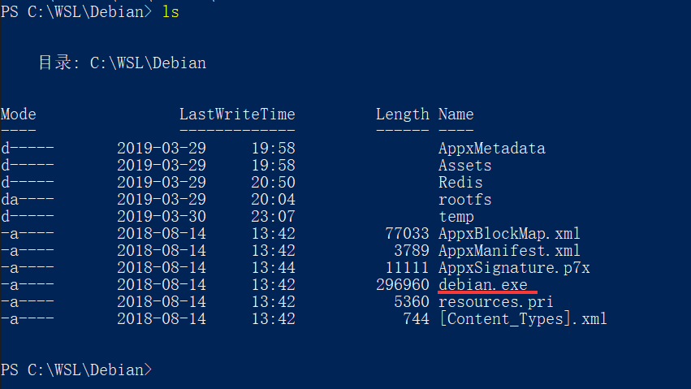

Windows Subsystem for Linux
===

The Windows Subsystem for Linux lets developers run GNU/Linux environment -- including most command-line tools, utilities, and applications -- directly on Windows, unmodified, without the overhead of a virtual machine.


## Manually Install the Windows Subsystem for Linux

### Enable `Windows Subsystem for Linux` optional feature

Before you can run Linux distros on Windows, you must enable the `Windows Subsystem for Linux` optional feature and reboot.

 1. Open PowerShell as Administrator and run:

```bash
Enable-WindowsOptionalFeature -Online -FeatureName Microsoft-Windows-Subsystem-Linux
```

 2. Restart your computer when prompted.

**This reboot is required** in order to ensure that WSL can initiate a trusted execution environment.

### Download and manually unpack and install

Here we take the installation of `Debian GNU/Linux` as an example, and installation directory is `C:\WSL\Debian`.

```bash
cd C:\WSL
```

 1. Download using PowerShell

```bash
Invoke-WebRequest -Uri https://aka.ms/wsl-debian-gnulinux -OutFile Debian.appx -UseBasicParsing
```

 2. Download using curl

```bash
curl.exe -L -o Debian.appx https://aka.ms/wsl-debian-gnulinux
```

 3. Extract and install a Linux distro

 Extract the <distro>.appx package's contents, e.g. using PowerShell:

```bash
Rename-Item Debian.appx Debian.zip
Expand-Archive Debian.zip Debian
```

Run the distro launcher To complete installation, run the distro launcher application in the target folder, named <distro>.exe. For example: `debian.exe`, etc.



 4. Setting up a new Linux user account

Once installation is complete, you will be prompted to create a new user account (and its password).

This user account is for the normal non-admin user that you'll be logged-in as by default when launching a distro.

## Update & upgrade your distro's packages

```bash
sudo apt update && sudo apt upgrade
```

---

For more details, please see:

 - https://docs.microsoft.com/en-us/windows/wsl/install-win10

